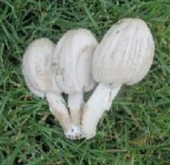

# ParallelKMeansSegmentation

This project implements parallel grayscale image segmentation using the 1D K-Means algorithm with MPI (Message Passing Interface) in C++. It processes grayscale or rgb images by clustering pixel intensities to generate segmented images with distinct grayscale shades.

## Overview
Image segmentation is the process of separating different objects in an image based on pixel intensities or other attributes. This project focuses on:
- Reading a grayscale or rgb image as input.
- Clustering pixel intensities using K-Means with a specified number of clusters (e.g., 3 for three regions).
- Replacing pixels in each cluster with the mean intensity of that cluster to produce the final segmented image.

### Example Input and Output

#### Input Image
  
*Sample rgb image provided as input.*

#### Output Image
  
*The segmented grayscale image with distinct shades.*

## Features
- **Parallel Processing**: Efficient image segmentation using multiple processes with MPI.
- **K-Means Clustering**: Groups pixel intensities into distinct clusters for simplified visual representation.
- **Intensity Scaling**: Maps clustered pixel values to their respective mean intensities for clearer segmentation.
- **Support for Large Images**: Handles high-resolution grayscale images efficiently with parallel computation.

## Technologies
- **Programming Language**: C++
- **Parallel Framework**: MPI (Message Passing Interface)
- **Algorithm**: K-Means Clustering

## Usage
Run the program with MPI:
   ```bash
   mpiexec -n 4 ParallelKMeanSegmentation.exe


